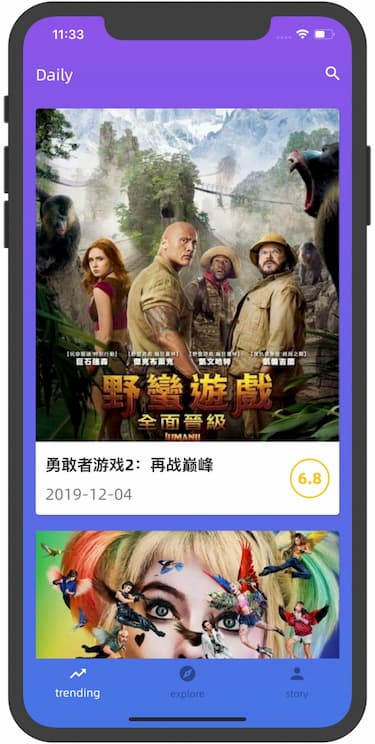
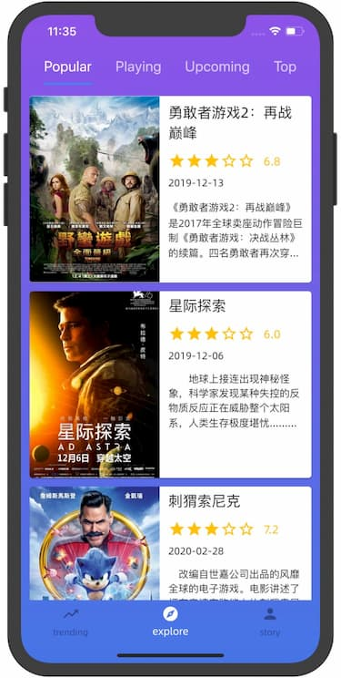
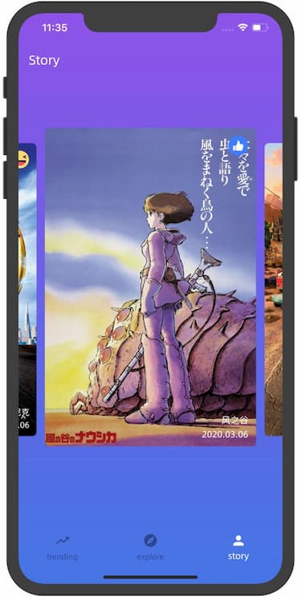
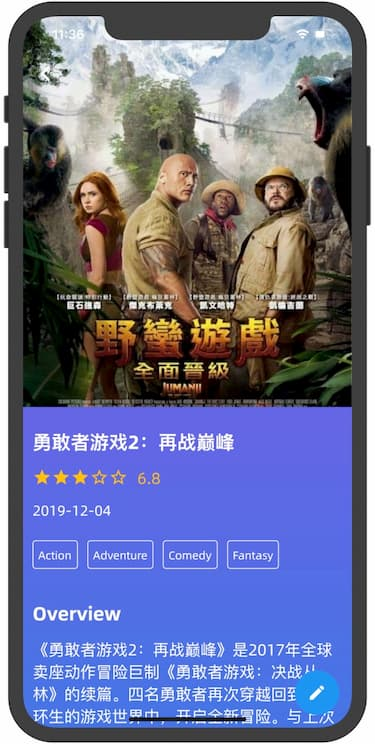
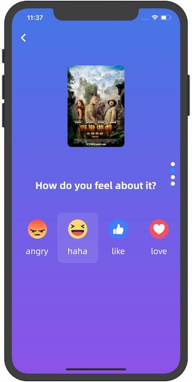

#  Feeling 

[](https://codemagic.io/apps/5e382b98cb1395ce61fb0fec/5e382b98cb1395ce61fb0feb/latest_build)

<a href='https://play.google.com/store/apps/details?id=fun.coldstone.Feeling&pcampaignid=pcampaignidMKT-Other-global-all-co-prtnr-py-PartBadge-Mar2515-1' target="_blank"></a>

## Screenshots

<div style="display: flex;">





</div>

## Api

[The movie db](https://www.themoviedb.org/documentation/api)

## Feture

- Trending movies
- Popular movies
- Playing movies
- Upcoming movies
- Top rate movies
- Write you movie review

## Development

create a `.env` file with

```env
TMDB_AUTH_V3=your tmdb api key
```

## Contribute

1. Fork it (https://github.com/xrr2016/feeling.git)
2. Create your feature branch (git checkout -b feature/foo)
3. Commit your changes (git commit -am 'Add some foo')
4. Push to the branch (git push origin feature/foo)
5. Create a new Pull Request

## License

[MIT](./LICENSE)
